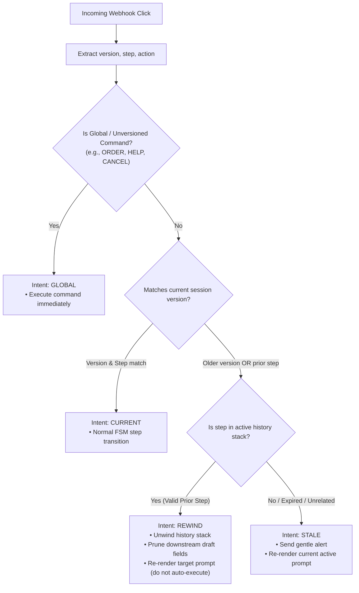

# Chat Interaction Guard (`chat-interaction-guard`)
> A lightweight, zero-dependency engine for versioned interactions, safe stale-button rewinds, and back-navigation in conversational bots (WhatsApp, Telegram, Slack, Messenger).

---

## 1. Executive Summary & The Problem

Building multi-step conversational workflows (FSMs) for chat platforms (WhatsApp Cloud API, Telegram, Slack, Messenger) has a fatal blind spot that web and mobile app frameworks never have to deal with:

> **The Immutable Canvas Paradox:**  
> In web/mobile apps, when a user transitions from Screen A to Screen B, Screen A is **unmounted** and its buttons cease to exist.  
> In chat apps, **the UI never unmounts**. The entire chat transcript is an immutable, append-only history. Every button, quick-reply, and list menu the bot has ever sent remains **permanently clickable forever**.

```
          TRADITIONAL GUI                          CONVERSATIONAL CHAT (WhatsApp / Telegram)
┌─────────────────────────────────┐           ┌───────────────────────────────────────────────┐
│ Screen 1: Choose Meal           │           │ [Bot] Step 1: Choose Meal                     │
│ [ Lunch ]   [ Dinner ]          │           │   (•) Lunch   (•) Dinner                      │
└─────────────────────────────────┘           │                                               │
               │                              │ [User taps "Lunch"]                           │
               ▼ (Screen 1 Unmounts)          │                                               │
┌─────────────────────────────────┐           │ [Bot] Step 2: Choose Address                  │
│ Screen 2: Choose Address        │           │   (•) Home    (•) Work                        │
│ [ Home ]    [ Work ]            │           │                                               │
└─────────────────────────────────┘           │ [User scrolls up 3 messages and taps "Dinner"]│
(User CANNOT click "Lunch" again)             │ 💥 WHAT HAPPENS TO YOUR BACKEND NOW?          │
                                              └───────────────────────────────────────────────┘
```

---

## 2. Real-World Failures in Naive Chat Bots

When a user scrolls up and clicks a button from an earlier step or an earlier session, 99% of chat bots fail in one of five destructive ways:

| Failure Mode | What Happens Under the Hood | User Experience Impact |
|---|---|---|
| **1. State Corruption** | FSM is at `awaiting_payment`, user clicks `choice_lunch` from Step 1. The FSM tries to interpret `"lunch"` as an address or payment token. | Corrupted database records, wrong charges, or ghost orders. |
| **2. Unhandled Exception / Crash** | FSM has no transition from `awaiting_payment` on event `choice_lunch`. State machine throws an unhandled error. | Bot goes completely silent. User thinks the service is dead. |
| **3. Accidental Rewind & Data Loss** | Bot treats the button as valid and transitions back to Step 1 without resetting draft data or downstream locks. | Zombie state where payment links remain active while draft is half-reset. |
| **4. The Silent Dead-Click** | Backend silently drops unrecognized events because they don't match the active state. | User furiously taps the button repeatedly, gets zero feedback, and churns. |
| **5. The "Back" Button Chaos** | User taps "Back" multiple times, or taps an ancient "Back" button from yesterday's order. | Infinite back loops, stack underflows, or popping outside session boundaries. |

---

## 3. Why Existing Frameworks Do Not Solve This

- **XState, Robot, Machina:** Built for in-memory or single-page application environments where the event source is controlled and old controls are destroyed when views change.
- **Meta Cloud API / Baileys / Twilio SDKs:** Pure transport layers. They deliver the raw webhook event `{ type: "button", id: "btn_123" }` and wash their hands of conversational continuity.
- **Botpress, Rasa, Dialogflow:** Heavyweight, opinionated monoliths that lock you into their ecosystem or cloud runtimes, yet still lack granular monotonic versioning for discrete interactive buttons.

There is currently **no standard, framework-agnostic micro-library** specifically dedicated to **payload version encoding, semantic intent classification, and safe history stack unwinding** for interactive chat applications.

---

## 4. The Core Solution Architecture

The solution developed and battle-tested in production relies on three pillars:

### Pillar A: Monotonic Flow Versioning
Every state transition increments a session flow version number (`flow_version: 1 -> 2 -> 3`).

### Pillar B: Compact Tagged Reply IDs
Every interactive element sent to WhatsApp/Telegram embeds its flow version and originating step into its identifier, staying well within WhatsApp’s **256-byte ID limit**:

$$\text{Format: } \texttt{v\{version\}:\{step\}:\{action\}}$$

Examples:
- `v1:awaiting_slot:lunch`
- `v2:awaiting_address:home`
- `v3:awaiting_schedule_confirm:confirm_yes`
- `v3:awaiting_schedule_confirm:back_button`

### Pillar C: Semantic Intent Classification
When a webhook delivers an interaction, the engine compares the payload against the current session and resolves it into one of four distinct intents:



---

## 5. Library Specification: `chat-interaction-guard`

### 5.1 Design Goals
1. **Zero Dependencies**: 100% pure TypeScript; zero external runtime dependencies.
2. **Framework Agnostic**: Works with Express, Fastify, Next.js, Hono, NestJS, AWS Lambda, Cloudflare Workers.
3. **Transport Agnostic**: Native helpers for WhatsApp Cloud API (Meta), Twilio, Telegram, Slack.
4. **Sub-millisecond Performance**: Synchronous pure-function evaluation with zero database overhead.
5. **Strict Constraint Compliance**: Handles WhatsApp's 256-**byte** limit, 3-button quick reply limit, and 10-row list menu restrictions (Telegram's `callback_data` is even tighter: 64 bytes).
6. **Fail-Closed by Default**: Malformed, foreign, or out-of-band payloads resolve to an `unknown` intent — the resolver never throws inside the webhook path.
7. **Idempotent Interactions**: Redelivered webhooks and double-taps collapse into a `duplicate` intent instead of executing the transition twice.
8. **Byte-Accurate Limits**: Payload size limits are measured in UTF-8 bytes, not characters.

---

## 6. Proposed API Design

### 6.1 Creating the Codec

```typescript
import { createInteractionGuard } from 'chat-interaction-guard';

const guard = createInteractionGuard({
  versionPrefix: 'v',        // Defaults to 'v'
  delimiter: ':',            // Defaults to ':'
  maxPayloadLength: 256,     // WhatsApp hard limit
  globalActions: ['back_button', 'cancel', 'help', 'menu'],
});
```

> ⚠️ **Global precedence caveat:** `globalActions` match by action name *before* the version/step matrix, at any version. Don't give a step-local action the same name as a registered global — a fresh `cancel` click routes globally (usually what you want for `cancel`, but a footgun for anything else).

### 6.2 Encoding Buttons / List Rows (Outbound)

```typescript
// Sending an interactive button to WhatsApp
const payloadId = guard.encode({
  version: session.flowVersion, // e.g., 4
  step: 'awaiting_slot',
  action: 'lunch',
});
// => "v4:awaiting_slot:lunch"

const button = {
  type: 'reply',
  reply: {
    id: payloadId,
    title: 'Lunch (1 PM)',
  },
};
```

### 6.3 Resolving Incoming Interactions (Inbound)

```typescript
// In your webhook handler:
const intent = guard.resolveIntent({
  rawId: req.body.entry[0].changes[0].value.messages[0].interactive.button_reply.id,
  // For plain text messages pass `text` instead — global commands like
  // "cancel" / "help" are classified the same way as button payloads.
  currentStep: session.currentStep,
  currentVersion: session.flowVersion,
  historyStack: session.historyStack, // ['home', 'awaiting_plan', 'awaiting_slot']
});

switch (intent.kind) {
  case 'current': {
    // User clicked a button from the currently active prompt
    return await stateMachine.transition(session, intent.action);
  }

  case 'rewind': {
    // User clicked a button from an earlier step!
    // 1. Unwind history stack to the target step
    const updatedHistory = guard.unwindHistory(session.historyStack, intent.targetStep);
    
    // 2. Prune downstream draft keys
    const cleanDraft = guard.pruneDraft({
      draft: session.draft,
      unwoundSteps: intent.prunedSteps,
    });

    // 3. Save new state at incremented version
    session.historyStack = updatedHistory;
    session.currentStep = intent.targetStep;
    session.flowVersion += 1;

    // 4. Re-render the step prompt for a deliberate choice
    return await bot.renderStep(session.phone, intent.targetStep);
  }

  case 'stale': {
    // User clicked a button from yesterday, or an invalid prior session
    await bot.sendMessage(
      session.phone,
      "⚠️ That button is from an earlier message. Here is where you left off:"
    );
    return await bot.renderStep(session.phone, session.currentStep);
  }

  case 'global': {
    // Global actions (like 'back_button' or 'cancel') — match at ANY version
    return await handleGlobalAction(session, intent.action);
  }

  case 'duplicate': {
    // The exact same ID was already processed (webhook redelivery / double-tap).
    // Do NOT re-execute the transition. Re-acknowledge or silently ignore.
    return;
  }

  case 'unknown': {
    // Unparseable or foreign ID, or free text that isn't a global command.
    return await bot.sendMessage(session.phone, "🤖 I didn't understand that.");
  }
}

// After handling ANY interaction, persist the raw ID so redeliveries
// can be detected as duplicates on the next webhook:
if ('rawId' in intent) session.lastInteractionId = intent.rawId;
```

### 6.4 WhatsApp Cloud API Adapter (Phase 2)

...

Import from the `chat-interaction-guard/whatsapp` subpath. The adapter attaches versioned reply IDs to `interactive.action.buttons` and `interactive.action.sections[].rows` — and fails fast on every platform constraint (3-button cap, 10-row cap, 20/24/72-character limits) *before* Meta rejects the whole webhook with a vague error.

```typescript
import { createInteractionGuard } from 'chat-interaction-guard';
import { createWhatsAppAdapter, extractInboundInteraction } from 'chat-interaction-guard/whatsapp';

const guard = createInteractionGuard({ globalActions: ['cancel', 'help'] });
const wa = createWhatsAppAdapter(guard);

// ── Outbound: interactive buttons ──────────────────────────────────
const action = wa.buildButtonsAction({
  version: session.flowVersion,
  step: 'awaiting_slot',
  options: [
    { action: 'lunch', title: 'Lunch (1 PM)' },
    { action: 'dinner', title: 'Dinner (7 PM)' },
  ],
});
// => { buttons: [{ type: 'reply', reply: { id: 'v4:awaiting_slot:lunch', title: 'Lunch (1 PM)' } }, …] }

// ── Outbound: list menus (up to 10 rows across sections) ───────────
const listAction = wa.buildListAction({
  version: session.flowVersion,
  step: 'awaiting_slot',
  buttonText: 'Choose meal',
  sections: [
    { title: 'Meals', rows: [{ action: 'lunch', title: 'Lunch', description: 'Served at 1 PM' }] },
  ],
});
// => { button: 'Choose meal', sections: [{ title: 'Meals', rows: [{ id: 'v4:awaiting_slot:lunch', … }] }] }

// ── Inbound: normalize the webhook message, then classify ──────────
const inbound = extractInboundInteraction(messages[0]); // entry[].changes[].value.messages[0]
if (inbound) {
  const intent = inbound.kind === 'payload'
    ? guard.resolveIntent({ rawId: inbound.rawId }, session)
    : guard.resolveIntent({ text: inbound.text }, session);
}
```

Constraint violations throw `WhatsAppError` with a machine-readable `code` (`too_many_buttons`, `too_many_rows`, `invalid_title`, `duplicate_action`, …) — catch them in dev; they should never reach Meta.

### 6.5 Telegram Inline Keyboard Adapter (Phase 2)

Import from the `chat-interaction-guard/telegram` subpath. Telegram's `callback_data` is the tightest constraint in chat — **64 UTF-8 bytes**, sealed at send time — and Telegram **silently strips `&`** and a few other chars, so `v1:step:help_me` arrives as `v1:keydata` and mismatches. This adapter enforces the limit and rejects dangerous chars by default.

```typescript
import { createInteractionGuard } from 'chat-interaction-guard';
import { createTelegramAdapter, extractTelegramCallback } from 'chat-interaction-guard/telegram';

const guard = createInteractionGuard({ globalActions: ['cancel', 'help'] });
const tg = createTelegramAdapter(guard);

// ── Outbound: Inline Keyboard (max 5 buttons/row, 20 total) ───────
const kb = tg.buildKeyboard({
  version: session.flowVersion,
  step: 'awaiting_slot',
  rows: [
    [{ action: 'lunch', text: 'Lunch 🍔' }, { action: 'dinner', text: 'Dinner 🍝' }],
    [{ action: 'cancel', text: 'Cancel' }],
  ],
});
// => { inline_keyboard: [
//     [{ text: 'Lunch 🍔', callback_data: 'v4:awaiting_slot:lunch' }, …],
//     [{ text: 'Cancel', callback_data: 'v4:awaiting_slot:cancel' }],
//   ] }

// ── Inbound: read callback_data straight from an Update ───────────
const raw = update.callback_query?.data ?? update.message?.reply_to_message?.reply_markup?.inline_keyboard?.[0]?.[0]?.callback_data;
if (raw) {
  const payload = extractTelegramCallback(raw);
  session.lastInteractionId = payload;
  const intent = guard.resolveIntent({ rawId: payload }, session);
  // answerCallbackQuery({'text': '…'}) to dismiss the loading spinner
}
```

> **The dangerous-char check is defense-in-depth, not the primary guard.**
> With the default `:` delimiter it is *unreachable*: the codec validates `step`
> and `action` against `[A-Za-z0-9_-]+`, so `a&b`, `a+b` and `a b` are already
> rejected by `guard.encode()` with `PayloadError('unsafe_token')` before the
> adapter ever inspects the encoded string. You get an error either way — just a
> more specific one, from a more appropriate layer.
>
> It earns its place because `resolveCodecConfig` accepts any *single* delimiter
> character outside `[A-Za-z0-9_-]` — including a space. A caller who configures
> `createInteractionGuard({ delimiter: ' ' })` really does put stripped chars into
> `callback_data`, and that is the case this check exists to catch:
>
> ```typescript
> const spaced = createTelegramAdapter(createInteractionGuard({ delimiter: ' ' }));
> spaced.buildKeyboard({ version: 1, step: 's', rows: [[{ action: 'ok', text: 'Bad' }]] });
> // throws TelegramError('callback_data_unsafe')
> ```
>
> Pass `{ followStrict: false }` to skip the check and take responsibility for
> sanitising labels yourself.

### 6.6 Interactive Playground (Phase 3)

Watch the engine make every §7 decision live — on **any of the four transports**:

```bash
npm run playground        # or, once published: npx chat-interaction-guard
```

A fake food-ordering bot renders prompts; every button ever rendered stays clickable. Answer the current prompt with `<number>`, or click **any old button** with `@<number>` and watch intents fire: `CURRENT` transitions, `REWIND` unwinds the stack and prunes draft keys, `STALE` re-renders, `DUPLICATE` suppresses double-taps, `GLOBAL` handles `cancel`/`back`.

This is not a mock. Each prompt is built by the **real adapter** for the
active transport, so the `wire:` line is the actual JSON that platform would
receive — and every `@n` click is replayed through **that platform's own
extractor**, from the exact webhook body it would POST back:

```
[you] > transport slack
switched to Slack Block Kit. Old buttons keep their original payloads.

[bot] 📦 Pick a plan:
      Slack Block Kit · value ≤ 2000 chars, ≤ 25 elements, ≤ 5/row · wire ids ✓
      wire: {"blocks":[{"type":"actions","block_id":"chat-interaction","elements":[
        {"type":"button","text":{"type":"plain_text","text":"Starter box"},
         "value":"v2:awaiting_plan:starter","action_id":"chat_interaction"}, … ]}]}

[you] > @2
   ↩ replaying via WhatsApp Cloud API: {"interactive":{"button_reply":{"id":"v1:home:order"}}}
      → {"kind":"payload","rawId":"v1:home:order"}

REWIND    click from prior step home @ v1 (prunes: awaiting_plan, awaiting_slot)
   ⏪ unwinding stack ["home","awaiting_plan","awaiting_slot"] → ["home"]
```

Switching transport mid-session is the point of the exercise, not a reset: the
transcript records which channel rendered each button, so a WhatsApp button
rendered before the switch is still replayed through the **WhatsApp** extractor
even while you are on Slack — because that is what really happens to a message
already sitting in someone's chat window.

The `ids ✓` marker is a live assertion, not decoration. After every render the
playground reads the ids **back out of the built payload** by walking that
platform's wire shape — deliberately independent of the code that put them
there — then feeds each one through the adapter's extractor and confirms it
comes back unchanged. So a prompt only reads `ids ✓` if the adapter genuinely
embedded the reply id *and* the inbound path can recover it. If either half
breaks, the render says so loudly:

```
      ⚠ WIRE ID MISMATCH: payload carries 0 id(s), expected 2
```

That catches the two failure modes unit tests miss: an adapter that silently
stops embedding the id, and an extractor that stops reading the field the
adapter writes.

Commands: `transport` (list), `transport X` (switch to
`whatsapp | telegram | slack | twilio`), `wire` (pretty-print the last payload),
`transcript`, `debug`, `quit`.

### 6.7 Slack Block Kit Adapter (Phase 2)

Import from the `chat-interaction-guard/slack` subpath. Slack is the most
permissive channel here — the button `value` carries a full **2000 characters**
against Telegram's 64 — but it is *not* safe by default, for a different reason:
**Slack never invalidates an old message.** Every button ever posted to a channel
stays live indefinitely. That is the Immutable Canvas problem in its purest
form, and it is why `action_id` routing alone will never save you.

```typescript
import { createInteractionGuard } from 'chat-interaction-guard';
import { createSlackAdapter, extractSlackAction } from 'chat-interaction-guard/slack';

const guard = createInteractionGuard({ globalActions: ['cancel', 'help'] });
const slack = createSlackAdapter(guard, { actionId: 'booking_cta' });

// ── Outbound: an `actions` block (max 25 elements, 5 per row) ──────
const block = slack.buildActionsBlock({
  version: session.flowVersion,
  step: 'awaiting_slot',
  rows: [
    [{ action: 'lunch', text: 'Lunch 🍔' }, { action: 'dinner', text: 'Dinner 🍝' }],
    [{ action: 'cancel', text: 'Cancel' }],
  ],
});
// => { type: 'actions', block_id: 'chat-interaction', elements: [
//      { type: 'button', text: { type: 'plain_text', text: 'Lunch 🍔' },
//        value: 'v4:awaiting_slot:lunch', action_id: 'booking_cta' }, … ] }

// ── Inbound: normalize a `block_actions` callback ───────────────────
app.action('booking_cta', async ({ ack, body, action }) => {
  await ack();
  const got = extractSlackAction(body);
  if (got?.kind === 'payload') {
    session.lastInteractionId = got.rawId;
    const intent = guard.resolveIntent({ rawId: got.rawId }, session);
    // STALE and REWIND both arrive here from buttons posted minutes ago
  }
});
```

Slack has no nested "row" concept — elements flow inline and wrap on their own —
so `rows` is accepted to mirror the Telegram API and let callers control
grouping. Flattening preserves render order.

> **The 2000-character value ceiling is unreachable under the default codec.**
> `maxPayloadLength` defaults to 256, so an over-long action is rejected by
> `guard.encode()` first. The ceiling matters for the callers who *raise* it to
> exploit Slack's headroom — bound the guard to 2048 and the adapter holds the
> real platform limit:
>
> ```typescript
> const roomy = createSlackAdapter(createInteractionGuard({ maxPayloadLength: 2048 }));
> roomy.buildActionsBlock({ version: 1, step: 's', rows: [[{ action: 'a'.repeat(2001), text: 'X' }]] });
> // throws SlackError('value_too_long')
> ```

### 6.8 Twilio Content API Adapter (Phase 2)

Import from the `chat-interaction-guard/twilio` subpath. Twilio proxies
WhatsApp, so it inherits WhatsApp's rules and adds two of its own. The reply id
travels in the **`id`** field, capped at **200 characters**.

**The quick-reply cap is not a single number.** Twilio permits **10 buttons for
templates**, but only **3 in an in-session message** — and in-session is what
every chatbot in this library's audience is doing. So 3 is the default, and 10
is opt-in:

```typescript
import { createInteractionGuard } from 'chat-interaction-guard';
import { createTwilioAdapter, extractTwilioInteraction } from 'chat-interaction-guard/twilio';

const guard = createInteractionGuard({ globalActions: ['cancel'] });
const tw = createTwilioAdapter(guard);                    // in-session: 3 buttons

// ── twilio/quick-reply ────────────────────────────────────────────
const content = tw.buildQuickReplies({
  version: session.flowVersion,
  step: 'awaiting_slot',
  body: 'What would you like?',
  options: [
    { action: 'lunch', title: 'Lunch 🍔' },
    { action: 'dinner', title: 'Dinner 🍝' },
    { action: 'cancel', title: 'Cancel' },
  ],
});
// => { body: 'What would you like?', actions: [
//      { type: 'QUICK_REPLY', title: 'Lunch 🍔', id: 'v4:awaiting_slot:lunch' }, … ] }

// Generating an approved template instead?
const templated = createTwilioAdapter(guard, { maxQuickReplies: 10 });

// ── twilio/list-picker (flat — no sections, unlike Meta) ──────────
const picker = tw.buildListPicker({
  version: session.flowVersion,
  step: 'awaiting_slot',
  body: 'Pick a destination',
  button: 'Choose',
  items: [
    { action: 'sfo', item: 'SFO → NYC $299', description: 'Flight 1337' },
    { action: 'oak', item: 'OAK → DEN $149', description: 'Flight 5280' },
  ],
});

// ── Inbound: Twilio POSTs the id back in ButtonPayload ────────────
// (ListItemSelected.id for a list-picker selection)
app.post('/whatsapp', (req, res) => {
  res.send('<Response/>');                       // Twilio wants 200 fast
  const got = extractTwilioInteraction(req.body);
  if (got?.kind === 'payload') {
    session.lastInteractionId = got.rawId;
    const intent = guard.resolveIntent({ rawId: got.rawId }, session);
  }
});
```

Two Twilio-specific rules the adapter encodes that are easy to miss: a
list-picker **cannot open a business-initiated session** (it is session-only and
never goes for approval), and Twilio marks `description` as **required** on
list items — unlike Meta, where it is optional.

> **Unlike the Telegram and Slack ceilings, the 200-character id check fires at
> the default codec config.** Those adapters' limits sit *above* the codec's
> `maxPayloadLength` default of 256, so you only meet them after deliberately
> raising the limit. Twilio's 200 is below it, which makes this the one adapter
> ceiling that guards you out of the box:
>
> ```typescript
> tw.buildQuickReplies({ version: 1, step: 's', body: 'b',
>   options: [{ action: 'a'.repeat(196), title: 'Long' }] });
> // throws TwilioError('id_too_long') — 201-character id
> ```

### 6.9 Express & Fastify Middleware (Phase 3)

Import from `chat-interaction-guard/middleware`. This wires
`guard.resolveIntent` to an HTTP route for both frameworks **without depending
on either** — `req` and `reply` are described structurally, only by the members
actually touched, so the package keeps its zero-dependency guarantee. (There are
no runtime imports in the built output at all.)

```typescript
import express from 'express';
import { createInteractionGuard } from 'chat-interaction-guard';
import { extractInboundInteraction } from 'chat-interaction-guard/whatsapp';
import { expressInteractionHandler } from 'chat-interaction-guard/middleware';

const guard = createInteractionGuard({ globalActions: ['cancel'] });

app.post('/webhooks/whatsapp', expressInteractionHandler({
  guard,
  extract: extractInboundInteraction,
  session: (body) => loadSession(body.entry[0].changes[0].value.messages[0].from),

  // Persist the handled id so redelivery and double-taps classify as `duplicate`.
  commit: (session, rawId) => saveLastInteractionId(session, rawId),

  onIntent: async (intent, { body }) => {
    switch (intent.kind) {
      case 'current':  return advance(intent.step, intent.action);
      case 'rewind':   return rewindTo(intent.targetStep, intent.prunedSteps);
      case 'stale':    return resendCurrentPrompt();   // the user clicked an old button
      case 'duplicate':return;                          // already processed
      case 'global':   return intent.action === 'cancel' ? abort() : help();
      case 'unknown':  return replySorry();             // never throw on junk
    }
  },
  onError: (err, body) => logger.error({ err, body }),
}));
```

Fastify is the same call with `fastifyInteractionHandler`, which returns the
reply so it composes with other hooks:

```typescript
import { fastifyInteractionHandler } from 'chat-interaction-guard/middleware';

fastify.post('/webhooks/telegram', fastifyInteractionHandler({
  guard,
  extract: telegramExtractor(extractTelegramCallback),  // Telegram returns a bare string
  session: loadSession,
  onIntent: handleIntent,
  ackBody: undefined,
}));
```

Three behaviours worth knowing, each of which a hand-rolled route usually gets
wrong:

1. **The ack is sent before your handler runs.** WhatsApp expects a 200 within
   20 seconds and Twilio retries hard. `onIntent` is allowed to be slow; work
   that must complete before the ack belongs elsewhere.
2. **Nothing user-controlled can 500 the route.** Every adapter extractor is
   fail-closed, and the wrapper contains the one case where `resolveIntent`
   throws (an empty input) plus any failure from your `session` or `commit`
   hook — all surface as an `error` outcome, never an unhandled rejection.
3. **`commit` is skipped for `stale`.** A stale click was never executed, so
   remembering its id would suppress the retry that *should* succeed.

---

## 7. State History Stack & Rewind Rules

| Action | Current Step | Target Step | Stack Before | Stack After | Action Taken |
|---|---|---|---|---|---|
| User clicks `v1:plan:starter` | `awaiting_slot` | `awaiting_plan` | `[home, plan, slot]` | `[home, plan]` | Unwind stack, drop slot data, prompt for plan |
| User clicks `v4:slot:lunch` | `awaiting_slot` | `awaiting_slot` | `[home, plan, slot]` | `[home, plan, slot]` | Normal transition to `awaiting_address` |
| User clicks `v1:home:start` | `awaiting_payment` | `home` | `[home, plan, slot, address, pay]` | `[home]` | Clean reset to home screen |
| Ancient click from 2 days ago | `awaiting_payment` | `awaiting_plan` | `[home, pay]` | `[home, pay]` | **STALE** (not in history). Alert user, keep on payment screen |
| Out-of-order webhook (payload v6 > session v4) | — | — | — | — | **STALE** (`future_version`). Never execute a "future" payload; safe re-render |
| Same ID delivered twice (double-tap / webhook redelivery) | — | — | — | — | **DUPLICATE**. Suppressed via `lastInteractionId`; never execute twice |

### 7.1 Stack Maintenance Helpers

The stack must stay correct on *every* transition, not just rewinds. The library ships the helpers so apps don't hand-roll them:

```typescript
import { pushStep, popStep, unwindHistory, pruneDraft } from 'chat-interaction-guard';

// Forward transition (e.g. awaiting_slot → awaiting_address):
session.historyStack = pushStep(session.historyStack, 'awaiting_address');

// "Back" button — pops exactly one step:
const back = popStep(session.historyStack); // { ok, stack, prunedSteps } | { ok: false, reason: 'stack_underflow' }

// Rewind to an arbitrary prior step (validates presence first):
const rewind = guard.unwindHistory(session.historyStack, 'awaiting_plan');
```

Invariants:
- `historyStack` always ends with `currentStep`.
- Every forward step is pushed exactly once (consecutive re-renders of the same step do **not** grow the stack).
- Rewind to a visited step truncates to its **most recent** occurrence (`lastIndexOf`), so repeat visits unwind correctly.

### 7.2 Draft-Key Convention

`pruneDraft` needs to know which draft fields belong to which step. Use one of two naming conventions — no configuration required:

| Convention | Example key | Pruned when step `awaiting_slot` is unwound? |
|---|---|---|
| Step-named key | `awaiting_slot` | ✅ |
| Namespaced key | `awaiting_slot:choice` | ✅ |
| Shared key | `meta` | ❌ kept |

### 7.3 Payload Safety Rules

- **Safe token alphabet**: steps and actions may only contain `[A-Za-z0-9_-]`. Anything else (spaces, emoji, a `:` inside an action) is rejected at encode time with a `PayloadError` and at decode time as `unsafe_token`. This makes the format immune to delimiter-injection from user-controlled strings.
- **Byte-accurate limits**: length is checked with UTF-8 byte length against `maxPayloadLength` (default `256`; pass `64` for Telegram `callback_data`).
- **Version range**: versions are positive safe integers (`v1`, `v2`, …). `v0`, negatives, and non-integers are unparseable.
- **Global precedence**: `globalActions` are matched by action name **before** the version/step matrix, at any version. Caveat: don't give a step-local action the same name as a registered global action — it will be routed globally.
- **Future versions are stale**: a payload whose version is *ahead* of the session (out-of-order webhook delivery, laggy session store) is never executed; it resolves to `stale` with reason `future_version`.
- **Duplicate suppression is single-slot**: `lastInteractionId` collapses immediate redeliveries and double-taps. For longer windows, keep your own processed-ID set in the session.
- **Fail-closed parsing**: `decode` never throws. Anything unparseable becomes `unknown` and the app decides what to say.

---

## 8. Open Source Strategy & Roadmap

### Phase 1: Core Engine ✅ (lives in `src/` in this repo)
- [x] Codec built from scratch (clean-room, no private-repo extraction): `encode` / `decode`, safe-token validation, byte-accurate limits.
- [x] Stack helpers: `pushStep`, `popStep`, `unwindHistory`, `pruneDraft`.
- [x] Intent resolver with **six** intents: `current`, `rewind`, `stale`, `global`, `duplicate`, `unknown`.
- [x] Zero-dependency strict TypeScript; dual ESM/CJS build via tsup; `engines: node >= 18`.
- [x] Vitest suite: full intent-matrix table tests, codec round-trip, hostile-input cases, history edge cases.
- [x] Quality gates: `npm run typecheck`, tests with coverage, benchmark suite backing the sub-millisecond claim.

### Phase 2: Transport & Channel Adapters
- [x] **Meta WhatsApp Cloud API Adapter**: `chat-interaction-guard/whatsapp` — attaches versioned reply IDs to `interactive.action.buttons` and `interactive.action.sections[].rows`, enforces all platform constraints at build time, and normalizes inbound webhook messages.
- [x] **Telegram Inline Keyboard Adapter**: `chat-interaction-guard/telegram` — builds `callback_data` with the 64-byte UTF-8 ceiling enforced and Telegram-dangerous chars rejected by default, plus an `extractTelegramCallback` helper.
- [x] **Slack Block Kit Adapter**: `chat-interaction-guard/slack` — builds `actions` blocks with the encoded reply id in the button `value` (2000-char ceiling), validates `action_id`/`block_id`, and normalizes inbound `block_actions` payloads.
- [x] **Twilio Content API Adapter**: `chat-interaction-guard/twilio` — builds `twilio/quick-reply` and `twilio/list-picker` content bodies with the encoded reply id in the 200-character `id` field, defaults to the 3-button in-session cap (10 opt-in for templates), and normalizes `ButtonPayload` / `ListItemSelected` webhooks.

### Phase 3: Developer Experience & Documentation
- [ ] Comprehensive documentation with interactive ASCII / Mermaid diagrams.
- [x] Interactive demo playground — `npm run playground` (CLI simulator; click any old button with `@n` and watch the intents fire).
- [x] All four transports wired into the playground (`transport X` / `wire`) — each prompt is built by the real adapter and every click replays through that platform's real extractor.
- [x] Pre-built middleware for Express / Fastify (`chat-interaction-guard/middleware`) — dependency-free, acks before dispatching so a slow handler cannot cost you the webhook, and contains every failure path.
- [ ] Next.js App Router route handler (`app/api/webhooks/[channel]/route.ts`).
- [x] GitHub Actions CI: typecheck + tests + coverage gate + build on every push (`.github/workflows/ci.yml`, Node 20 & 22 matrix).

### Phase 4: Release & Community Launch
- [ ] Publish to npm under `@chat-guard/core` or `chat-interaction-guard`.
- [ ] Launch on GitHub, Show HN (Hacker News), and Reddit (`r/node`, `r/whatsapp_api`).
- [ ] Write a technical deep-dive article: *"Why WhatsApp Bots Break When Users Scroll Up (and How to Fix the Immutable Canvas Problem)"*.

---

## 9. License
MIT License. Free for commercial and community use.
