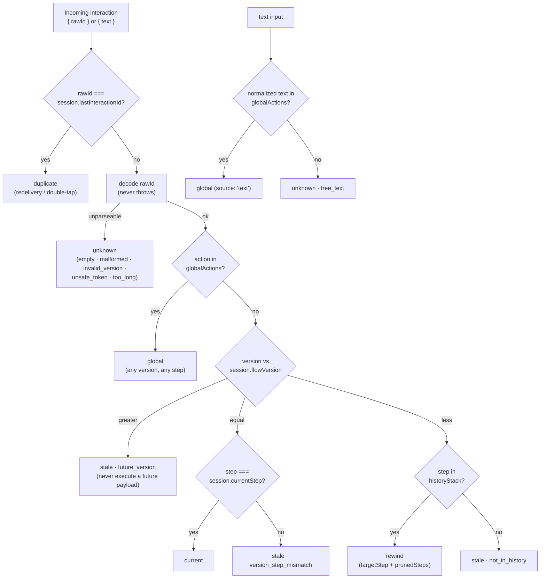
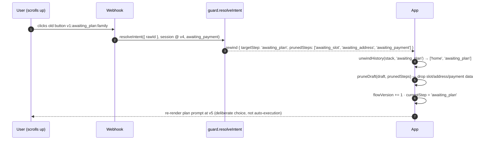
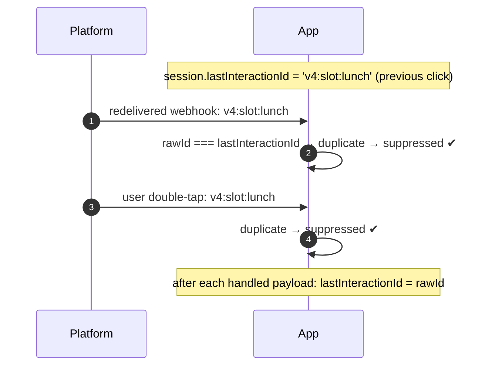

# Concepts

Why old buttons break bots, and how this engine decides what each old click
*means*. After this page, the API reference reads like a summary.

---

## 1. The Immutable Canvas Paradox

In a web or mobile app, moving from Screen A to Screen B **destroys** Screen
A's controls. In a chat app, nothing is ever destroyed: the transcript is an
append-only, immutable canvas, and every button the bot has ever sent remains
clickable forever — minutes later, days later, from any scroll position.

```
   WEB APP                              CHAT APP
┌───────────────────┐              ┌──────────────────────────────┐
│ Screen 1 unmounts │              │ msg 1 [ Starter ] [ Family ] │ ◄─ still live
│        │          │              │ msg 2 [ Lunch  ] [ Dinner ]  │ ◄─ still live
│        ▼          │              │ msg 3 [ Home   ] [ Work   ]  │ ◄─ still live
│ Screen 2 mounts   │              │ msg 4 [ Pay now ]            │ ◄─ still live
└───────────────────┘              └──────────────────────────────┘
        │                                        ▲
        └─ old controls are GONE       user scrolls up and taps anything
```

Naive bots fail in five predictable ways — state corruption, crashes, zombie
rewinds, silent dead-clicks, and back-button chaos (README §2 has the
post-mortems). The engine replaces all five with one decision function.

---

## 2. The three pillars

### Pillar A — Monotonic flow versioning

Every transition or rewind increments `session.flowVersion`:
`1 → 2 → 3 → …`. The version is the *render epoch*: it answers "which paint of
the conversation is currently on the user's screen?"

### Pillar B — Compact tagged reply ids

Every interactive element embeds its version and step at **send time**, so an
old button carries proof of its own age:

```
        v 4 : awaiting_slot : lunch
        │ │     │       │      │
        │ │     │       │      └─ action  — which button within the step
        │ │     │       └──────── step    — which step rendered it
        │ │     └──────────────────────── delimiter (default ':')
        │ └────────────────────────────── step
        └──────────────────────────────── versionPrefix (default 'v')
```

| Channel | Id travels in | Limit | Measured in |
|---|---|---|---|
| WhatsApp Cloud API | `reply.id` / list row `id` | 256 | UTF-8 **bytes** |
| Telegram | `callback_data` | 64 | UTF-8 **bytes** |
| Slack | button `value` | 2000 | characters |
| Twilio | `id` | 200 | characters |

Byte-accuracy matters: `byteLength()` counts UTF-8 bytes, so multibyte content
cannot silently overflow a channel that counts bytes. The safe-token alphabet
`[A-Za-z0-9_-]` for steps and actions makes the format immune to
delimiter-injection from user-controlled strings.

### Pillar C — Semantic intent classification

One pure function turns `{ rawId | text } + session` into exactly one of six
intents. Apps switch on `kind`; nobody inspects raw webhooks for routing.



What each intent obligates the app to do:

| Intent | Meaning | App must |
|---|---|---|
| `current` | Click on the prompt that is on screen | Execute the transition |
| `rewind` | Click on a **valid prior step** | Unwind stack, prune draft, **re-render** (never auto-execute) |
| `stale` | Unknown territory: too old, mismatched, or from the future | Alert + re-render current prompt |
| `global` | Registered action, any version | Run the global handler |
| `duplicate` | Exact id already processed | Suppress — do nothing |
| `unknown` | Unparseable id or unrecognized text | Say "I didn't understand that" |

---

## 3. The session

The engine owns no storage. It reads this shape and your app persists it:

```typescript
interface InteractionSession {
  currentStep: string;              // step whose prompt is on screen
  flowVersion: number;              // monotonic render version
  historyStack: readonly string[];  // visited steps, ends with currentStep
  lastInteractionId?: string;       // last processed payload id (dup suppression)
}
```

Persist it alongside your domain draft data — the guard never mutates it;
every mutation is your decision, made in response to an intent.

---

## 4. The history stack

The stack is the trail of visited steps. It is what makes *rewind* know where
"back" goes, and what makes *stale* distinguishable from *rewind*.

```
 forward A → B → C → D            user clicks D's "back"      user clicks A's old button
                                                                
 [A]                                [A B C D]                   [A B C D]
 [A B]        pushStep              [A B C]  popStep            [A]      rewind to A
 [A B C]      pushStep              (prunes: [D])               (prunes: [B C D])
 [A B C D]    pushStep
```

Three invariants the helpers maintain for you:

1. **The stack always ends with `currentStep`.**
2. **Consecutive duplicates collapse** — re-rendering the same step
   (validation errors, retries) never grows the stack.
3. **Rewind truncates to the *most recent* occurrence** (`lastIndexOf`), so
   revisited steps unwind to their latest position, not their first.

The full rewind, end to end — this is the sequence that naive bots get wrong:



The draft-key convention makes pruning configuration-free — a key belongs to
step `S` when the key **is** `S` or **starts with** `S:`:

| Draft key | Owned by | Pruned when `awaiting_slot` unwinds? |
|---|---|---|
| `awaiting_slot` | awaiting_slot | ✅ |
| `awaiting_slot:choice` | awaiting_slot | ✅ |
| `awaiting_address:line1` | awaiting_address | ❌ (kept — different step) |
| `meta` | shared | ❌ (kept — no step prefix) |

---

## 5. Duplicate suppression

Chat platforms retry webhooks, and users double-tap. The single-slot
`lastInteractionId` collapses both into `duplicate`:



Two deliberate edges:

- **Checked before parsing.** A redelivered id is a duplicate whether or not
  it still parses.
- **`stale` clicks are not committed.** A stale click never executed, so
  remembering its id would suppress the legitimate retry that *should*
  succeed.

Single slot = immediate redeliveries only. For longer windows, keep your own
processed-id set ([Recipes](./recipes.md)).

---

## 6. Global actions

`globalActions` short-circuit the version/step matrix **at any version** —
`cancel` must work even from a two-day-old message. For text input, the body
is trimmed and lowercased before the match, so "Cancel" matches `cancel`.

> ⚠️ **The precedence caveat:** because the check is by action name and runs
> *first*, a step-local action named like a registered global will always
> route globally. `cancel` is the action you almost certainly want global;
> name anything else something else.

---

## 7. Fail-closed by default

The trust boundary is the webhook payload — attacker-controlled by
definition. So the rule is: **user-controlled input never throws; programmer
errors always do.**

| Input | Behaviour |
|---|---|
| Garbage / foreign / oversized rawId | `unknown` intent with a reason — never throws |
| Future or mismatched versions | `stale` — never executed |
| Neither `rawId` nor `text` given | `TypeError` — programmer error, by design |
| Bad guard config / bad encode input | `PayloadError` at build/encode time — programmer error |
| Hostile HTTP bodies | Middleware & Next.js handlers contain everything to `onError` |

`decode` also never throws — it returns `{ ok: false, reason }`, so hostile
strings become data, not exceptions.
