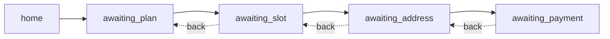

# Getting started

A working, guarded food-ordering bot in ~80 lines: **home → plan → slot →
address → payment**, with back navigation, stale-button safety, and duplicate
suppression — on WhatsApp Cloud API, served by Express.



The loop you are building:

```
   render a prompt ─────────► user taps (any button, any age)
        ▲                              │
        │                              ▼
   update session ◄──────────── resolveIntent(session, rawId)
   per intent                                  │
        │                          ┌───────────┼──────────┐
        └── current → transition   │           │          │
            rewind  → unwind+prune │           │          │
            stale   → re-render    │           │          │
            global  → cancel/back  │           │          │
            duplicate → ignore     ▼           ▼          ▼
            unknown  → "didn't understand"   (never crashes)
```

## 1. Install

```bash
npm install chat-interaction-guard
```

Zero runtime dependencies. TypeScript types included. Node ≥ 18, and it runs
unchanged on serverless and Edge runtimes.

## 2. The mental model in one screen

Your chat window after a few turns:

```
[bot] Welcome! Pick a plan:            ← every prompt ever sent
      [ Starter ]  [ Family ]            stays clickable forever
[bot] Pick a time slot:
      [ Lunch 1 PM ]  [ Dinner 7 PM ]
[bot] Where should we deliver?
      [ Home ]  [ Work ]
[bot] Confirm payment — $14.00
      [ Pay now ]

[user] ↑ scrolls up, taps "Family"     ← a button from 3 steps ago
```

That tap carries the id `v1:awaiting_plan:family` while your session is at
version 4, step `awaiting_payment`. Without a guard, that string hits your FSM
as a payment token. With the guard, it resolves to a **`rewind`**: unwind the
stack to `awaiting_plan`, drop the draft data for the abandoned steps, and
re-render the plan prompt. The user *meant* to go back — now they can, safely.

## 3. Create the guard

One guard per app. Its codec configuration is shared by every outbound button
and every inbound classification, so ids round-trip.

```typescript
// bot/guard.ts
import { createInteractionGuard } from 'chat-interaction-guard';

export const guard = createInteractionGuard({
  maxPayloadLength: 256,                     // WhatsApp hard limit (bytes)
  globalActions: ['cancel', 'help', 'back_button'],
});
```

> ⚠️ `globalActions` match **before** the version/step matrix, at any version.
> Never give a step-local action the same name as a registered global.

## 4. Send versioned buttons

Adapters build the platform's wire shape with the encoded id already stamped
in — and fail fast on every platform constraint before Meta ever sees it.

```typescript
// bot/send.ts
import { createWhatsAppAdapter } from 'chat-interaction-guard/whatsapp';
import type { InteractionSession } from 'chat-interaction-guard';

export const whatsapp = createWhatsAppAdapter(guard);

export function renderStep(session: InteractionSession) {
  switch (session.currentStep) {
    case 'home':
      return {
        type: 'interactive' as const,
        interactive: {
          type: 'button' as const,
          body: { text: 'Welcome! Pick a plan:' },
          ...whatsapp.buildButtonsAction({
            version: session.flowVersion,
            step: 'home',
            options: [
              { action: 'order', title: 'Order food' },
              { action: 'help', title: 'Help' },
            ],
          }),
        },
      };
    // … one case per step, same pattern
  }
}
```

Every forward transition bumps the version and grows the stack:

```typescript
session.flowVersion += 1;
session.currentStep = 'awaiting_slot';
session.historyStack = pushStep(session.historyStack, 'awaiting_slot');
session.draft = { ...session.draft, awaiting_plan: plan };
```

## 5. Classify an incoming click

```typescript
// bot/intent.ts
import { extractInboundInteraction } from 'chat-interaction-guard/whatsapp';

export function classify(message: unknown, session: InteractionSession) {
  const inbound = extractInboundInteraction(message); // button, list, or text
  if (!inbound) return null;                          // media, reactions, status pings

  return inbound.kind === 'payload'
    ? guard.resolveIntent({ rawId: inbound.rawId }, session)
    : guard.resolveIntent({ text: inbound.text }, session);
}
```

## 6. Handle the six intents

```typescript
import { popStep, pruneDraft, unwindHistory, type InteractionIntent } from 'chat-interaction-guard';

// Your app's session: the engine's shape plus your draft data. Properties are
// mutable (assignments replace state); the stack array itself stays readonly.
// Structurally satisfies InteractionSession wherever the engine reads it.
interface Session {
  currentStep: string;
  flowVersion: number;
  historyStack: readonly string[];
  lastInteractionId?: string;
  draft: Record<string, unknown>;
}

export async function handleIntent(intent: InteractionIntent, session: Session) {
  switch (intent.kind) {
    case 'current':                        // the prompt that is on screen
      return advance(session, intent.action);

    case 'rewind': {                       // an old button, but a valid step
      const unwind = unwindHistory(session.historyStack, intent.targetStep);
      if (!unwind.ok) return renderStep(session);          // defensive; already validated
      session.historyStack = unwind.stack;
      session.currentStep = intent.targetStep;
      session.flowVersion += 1;
      session.draft = pruneDraft({ draft: session.draft, unwoundSteps: intent.prunedSteps });
      return renderStep(session);          // re-render; do NOT auto-execute intent.action
    }

    case 'stale':                          // yesterday's button, or a future version
      return resendCurrentPrompt(session); // gently explain + re-render

    case 'global':                         // cancel / help / back_button, any version
      if (intent.action === 'back_button') {
        const back = popStep(session.historyStack);
        if (back.ok) {
          session.historyStack = back.stack;
          session.currentStep = back.stack.at(-1)!;
          session.flowVersion += 1;
          session.draft = pruneDraft({ draft: session.draft, unwoundSteps: back.prunedSteps });
        }
        return renderStep(session);
      }
      return intent.action === 'cancel' ? abortOrder(session) : sendHelp(session);

    case 'duplicate':                      // webhook redelivery or double-tap
      return;                              // already executed — do nothing

    case 'unknown':                        // junk ids, unrecognized free text
      return send(session, "🤖 I didn't understand that.");
  }
}
```

Two habits keep this correct:

1. **Persist `intent.rawId` after every payload interaction** (`duplicate`
   suppression needs it) — except for `stale`, where remembering the id would
   swallow the retry that *should* succeed:

   ```typescript
   if ('rawId' in intent && intent.kind !== 'stale' && intent.rawId !== undefined) {
     session.lastInteractionId = intent.rawId;
   }
   ```

   (The HTTP middleware below does this for you via `commit`.)
2. **Never `await` state changes between classification and persistence** in a
   way that can lose the id — see [Recipes → persistence](./recipes.md).

## 7. Wire the webhook

The middleware acks first, classifies second, and cannot be 500'd by hostile
input:

```typescript
// server.ts
import express from 'express';
import { expressInteractionHandler } from 'chat-interaction-guard/middleware';
import { extractInboundInteraction } from 'chat-interaction-guard/whatsapp';
import { handleIntent } from './bot/intent.js';
import { guard } from './bot/guard.js';

const app = express();
app.use(express.json());

app.post('/webhooks/whatsapp', expressInteractionHandler({
  guard,
  extract: extractInboundInteraction,
  session: (body) => loadSession(phoneOf(body)),
  commit: (session, rawId) => saveLastInteractionId(session, rawId),
  // `session()` returns your app Session; the context types it minimally.
  onIntent: (intent, { session }) => handleIntent(intent, session as Session),
  onError: (err) => console.error(err),
}));
```

That is the whole integration. The full platform checklist (Meta's GET
verification, Telegram secret tokens, Next.js routes) is in
[Platform guides](./platform-guides.md).

## 8. Watch it think

```bash
npx chat-interaction-guard
```

Click old buttons with `@<n>`, switch transports mid-session with
`transport slack`, and inspect the exact wire payloads with `wire`. Every
classification the playground prints is produced by the same `resolveIntent`
you just wired.

## What you have

| Guarantee | How |
|---|---|
| Old buttons rewind safely | `rewind` intent + `unwindHistory` + `pruneDraft` |
| Future/out-of-band clicks never execute | `stale` (`future_version`, `not_in_history`, …) |
| Redelivered webhooks execute once | `duplicate` via `lastInteractionId` |
| Junk input never crashes the route | `unknown` intent; middleware/next contain the rest |
| Platform constraints fail at build time | Adapter errors with machine-readable `code`s |

Next: [Concepts](./concepts.md) explains the machinery behind every row of
that table.
