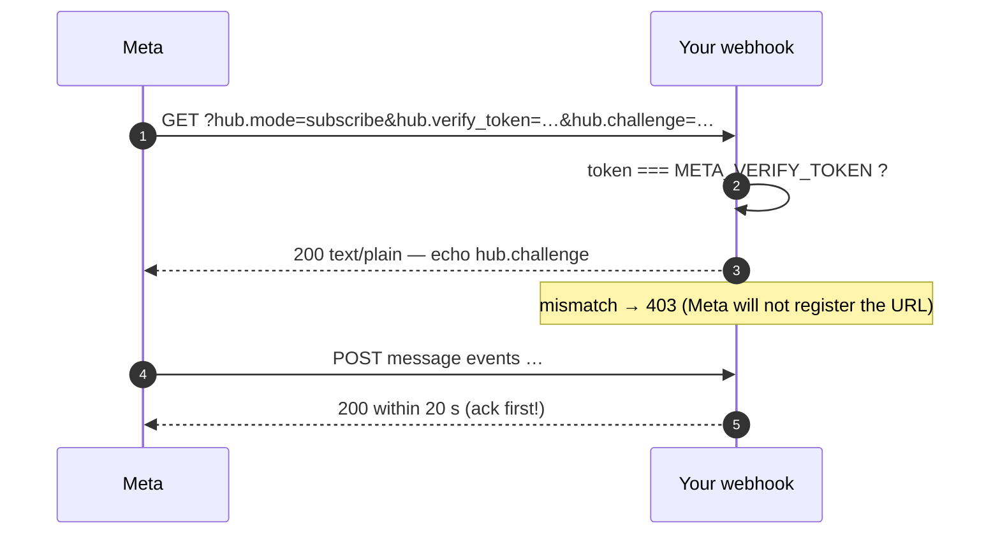

# Platform guides

One guard, five transports. Each section: constraints the adapter enforces,
the outbound/inbound round trip, and the platform's verification flow.

```
                  ┌──────────────────────────┐
   your code  ───►│  adapter (build + extract)│───► platform wire format
                  └──────────────────────────┘
   platform webhook ───► extractor ───► guard.resolveIntent ───► your FSM
```

At-a-glance limits:

| | WhatsApp (Meta) | Telegram | Slack | Twilio (WhatsApp) |
|---|---|---|---|---|
| Id travels in | `reply.id` / row `id` | `callback_data` | button `value` | `id` |
| Id limit | 256 bytes | **64 bytes** | 2000 chars | 200 chars |
| Buttons per message | 3 (list: 10 rows) | 5/row, 20 total | 25/block, ~5/row | 3 in-session, 10 template |
| Label limit | 20 chars | free (`text`) | 75 chars | 20 chars |
| Verification | GET `hub.challenge` | `X-Telegram-Bot-Api-Secret-Token` | request signing | Twilio signature |
| Retry behaviour | retries non-2xx | retries non-2xx | ack in 3 s | retries non-2xx **hard** |

---

## WhatsApp Cloud API (Meta)

```typescript
import { createInteractionGuard } from 'chat-interaction-guard';
import { createWhatsAppAdapter, extractInboundInteraction } from 'chat-interaction-guard/whatsapp';

const guard = createInteractionGuard({ globalActions: ['cancel', 'help'] });
const wa = createWhatsAppAdapter(guard);

// outbound — buttons
const action = wa.buildButtonsAction({
  version: session.flowVersion,
  step: 'awaiting_slot',
  options: [{ action: 'lunch', title: 'Lunch 1 PM' }],
});
// payload.interactive.action = action

// outbound — lists (up to 10 rows across sections)
const list = wa.buildListAction({
  version: session.flowVersion,
  step: 'awaiting_menu',
  buttonText: 'Choose meal',
  sections: [{ title: 'Meals', rows: [{ action: 'lunch', title: 'Lunch', description: 'Served 1 PM' }] }],
});

// inbound — one message object from entry[].changes[].value.messages[]
const inbound = extractInboundInteraction(messages[0]);
const intent = inbound
  ? guard.resolveIntent(inbound.kind === 'payload' ? { rawId: inbound.rawId } : { text: inbound.text }, session)
  : null;
```

**Verification handshake** — Meta GETs your URL before sending traffic. With
the Next.js handler this is one option; on Express it is a tiny route:



**Gotchas**

- The 20-second ack window is why every HTTP wrapper here acks before
  dispatching.
- Constraint violations should throw *your* side, never Meta's — a build-time
  `WhatsAppError('too_many_buttons')` beats a rejected webhook with a vague
  error.

---

## Telegram

Telegram's `callback_data` is sealed at **64 UTF-8 bytes** at send time, and
Telegram silently strips `& + space " ' < > ,` from it — an id that arrives
*mangled* mismatches at resolve time. The adapter rejects both failure modes
at build time (`followStrict` default):

```typescript
import { createTelegramAdapter, extractTelegramCallback } from 'chat-interaction-guard/telegram';

const tg = createTelegramAdapter(guard);   // set maxPayloadLength: 64 on the guard

const kb = tg.buildKeyboard({
  version: session.flowVersion,
  step: 'awaiting_slot',
  rows: [
    [{ action: 'lunch', text: 'Lunch 🍔' }, { action: 'dinner', text: 'Dinner 🍝' }],
    [{ action: 'cancel', text: 'Cancel' }],
  ],
});
// sendMessage(reply_markup: kb) — emoji is fine, callback_data is machine-only

// inbound — from a Telegram Update
const raw = update.callback_query?.data;
if (raw !== undefined) {
  session.lastInteractionId = extractTelegramCallback(raw);
  const intent = guard.resolveIntent({ rawId: raw }, session);
  // then answerCallbackQuery(...) to clear the loading spinner
}
```

**Gotchas**

- Create the guard with `maxPayloadLength: 64` so *encode* enforces Telegram's
  ceiling too; the adapter check then catches config drift.
- Telegram retries on non-2xx — ack fast; the middleware/Next handlers do.

---

## Slack

Slack never invalidates an old message — the Immutable Canvas problem in its
purest form — so `action_id` routing alone will never save you. The encoded id
travels in the button `value`:

```typescript
import { createSlackAdapter, extractSlackAction } from 'chat-interaction-guard/slack';

const slack = createSlackAdapter(guard, { actionId: 'booking_cta' });

// outbound
const block = slack.buildActionsBlock({
  version: session.flowVersion,
  step: 'awaiting_slot',
  rows: [[{ action: 'lunch', text: 'Lunch 🍔' }, { action: 'cancel', text: 'Cancel' }]],
});
// blocks: [block]

// inbound — a block_actions callback (Bolt)
app.action('booking_cta', async ({ ack, body, action }) => {
  await ack();                                   // Slack wants this within 3 s
  const got = extractSlackAction(body);
  if (got?.kind === 'payload') {
    session.lastInteractionId = got.rawId;
    const intent = guard.resolveIntent({ rawId: got.rawId }, session);
  }
});
```

**Gotchas**

- `rows` is grouping sugar — Slack flattens inline; order is preserved.
- Slack interactive payloads arrive **form-urlencoded** with the whole object
  JSON-encoded in one `payload` field. On Express you need a urlencoded body
  parser; on Next.js, compose the one-liner from
  [`defaultParseBody`](./api-reference.md#chat-interaction-guardnext):

  ```typescript
  parseBody: async (req) =>
    JSON.parse(String(((await defaultParseBody(req)) as { payload?: string }).payload)),
  ```

---

## Twilio (WhatsApp via Content API)

Twilio proxies WhatsApp, so it inherits WhatsApp's rules and adds its own: the
id rides in `id` (≤ 200 chars) and quick replies cap at **3 in-session** (10
for templates — opt in explicitly).

```typescript
import { createTwilioAdapter, extractTwilioInteraction } from 'chat-interaction-guard/twilio';

const tw = createTwilioAdapter(guard);                              // in-session: 3
const templated = createTwilioAdapter(guard, { maxQuickReplies: 10 }); // templates only

// outbound — quick replies
const content = tw.buildQuickReplies({
  version: session.flowVersion,
  step: 'awaiting_slot',
  body: 'What would you like?',
  options: [
    { action: 'lunch', title: 'Lunch 🍔' },
    { action: 'cancel', title: 'Cancel' },
  ],
});

// outbound — list picker (flat; description is REQUIRED, unlike Meta)
const picker = tw.buildListPicker({
  version: session.flowVersion, step: 'awaiting_menu',
  body: 'Pick a destination', button: 'Choose',
  items: [{ action: 'sfo', item: 'SFO → NYC', description: 'Flight 1337' }],
});

// inbound — Twilio POSTs form-urlencoded
app.post('/whatsapp', (req, res) => {
  res.send('<Response/>');                    // ack fast — Twilio retries hard
  const got = extractTwilioInteraction(req.body);
  if (got?.kind === 'payload') {
    session.lastInteractionId = got.rawId;
    const intent = guard.resolveIntent({ rawId: got.rawId }, session);
  }
});
```

**Gotchas**

- A list-picker **cannot open a business-initiated session** — session-only,
  never submitted for template approval.
- `description` is required on list items (the type enforces it).

---

## Express / Fastify middleware

Both wrappers ack before dispatching and contain every failure path — see
[Getting started §7](./getting-started.md#7-wire-the-webhook) for the Express
shape and the README §6.9 for the three behaviours worth knowing.

```typescript
fastify.post('/webhooks/telegram', fastifyInteractionHandler({
  guard,
  extract: telegramExtractor(extractTelegramCallback),   // bare-string adapter
  session: loadSession,
  onIntent: handleIntent,
  ackBody: undefined,
}));
```

---

## Next.js App Router

```typescript
// app/api/webhooks/[channel]/route.ts
import { nextWebhookRoute } from 'chat-interaction-guard/next';
import { extractInboundInteraction } from 'chat-interaction-guard/whatsapp';
import { createInteractionGuard } from 'chat-interaction-guard';
import { waitUntil } from 'next/server';

const guard = createInteractionGuard({ globalActions: ['cancel'] });

export const { POST, GET } = nextWebhookRoute({
  guard,
  extract: extractInboundInteraction,
  session: loadSession,
  commit: saveLastInteractionId,
  // `loadSession` returns your app Session; the context types it minimally.
  onIntent: (intent, ctx) => handleIntent(intent, ctx.session as Session),
  onError: (err) => console.error(err),
  waitUntil,                                   // serverless: keep dispatch alive
  verifyToken: process.env.META_VERIFY_TOKEN,  // powers the GET handshake
});
```

- **`POST` acks first**: the 200 returns immediately; classification runs in
  the background. `waitUntil` keeps serverless instances alive past the ack.
- **`verify`** gates the POST for header/signature checks (e.g. Telegram's
  secret token): `verify: (req) => req.headers.get('x-telegram-bot-api-secret-token') === process.env.TG_SECRET`.
- **GET** performs Meta's handshake when `verifyToken` is set; otherwise 405.
- Body parsing handles JSON and Twilio's urlencoded out of the box; see the
  Slack one-liner above for the third shape.
